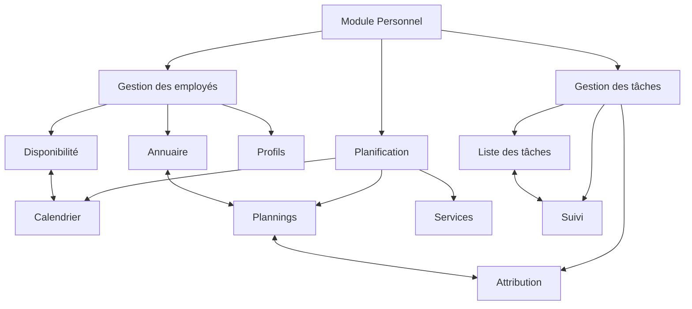
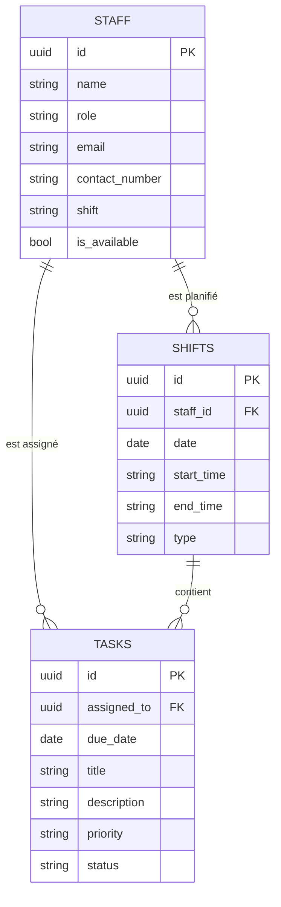
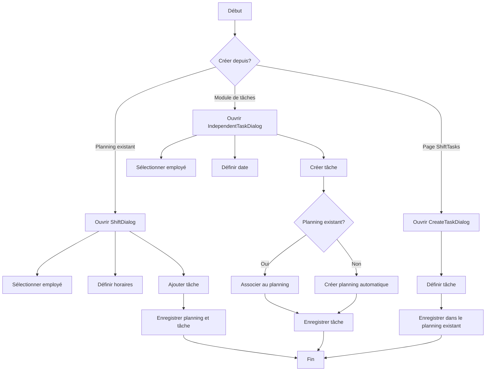
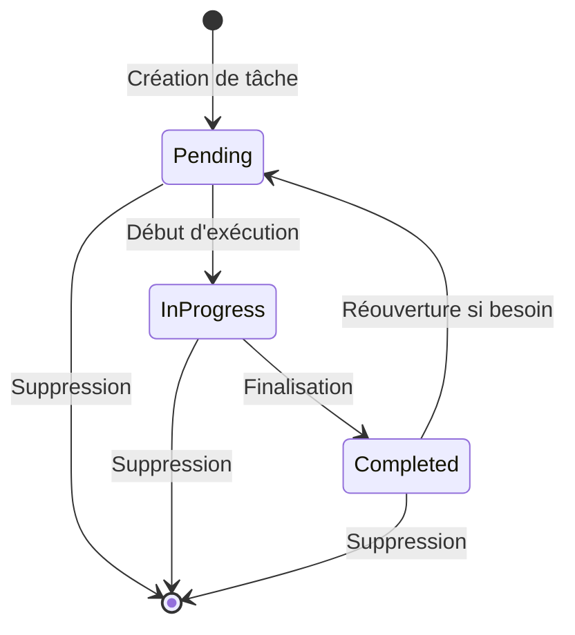

# Système de Gestion du Personnel et des Tâches - Architecture

Ce document présente l'architecture et les composants clés du système de gestion du personnel et des tâches.

## Architecture globale

## Structure des données

## Flux de création de tâches

## Flux de gestion des statuts de tâches

