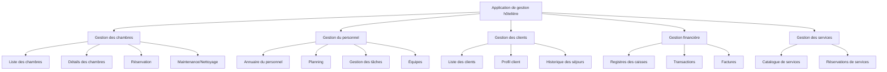
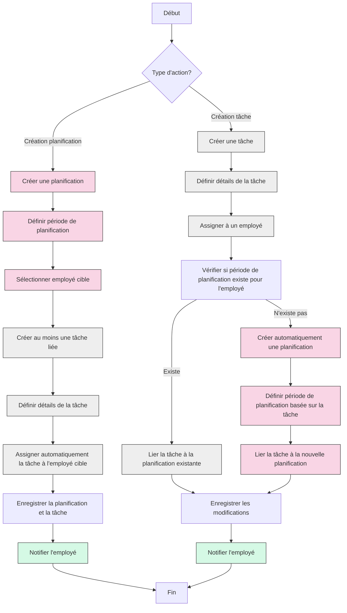
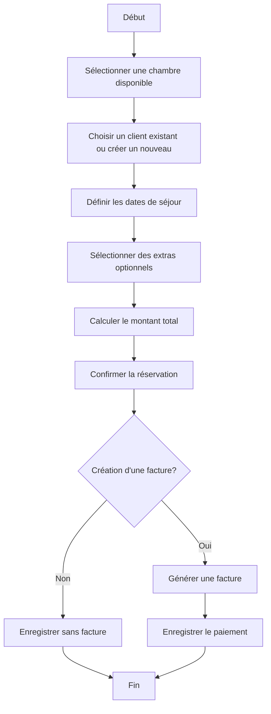
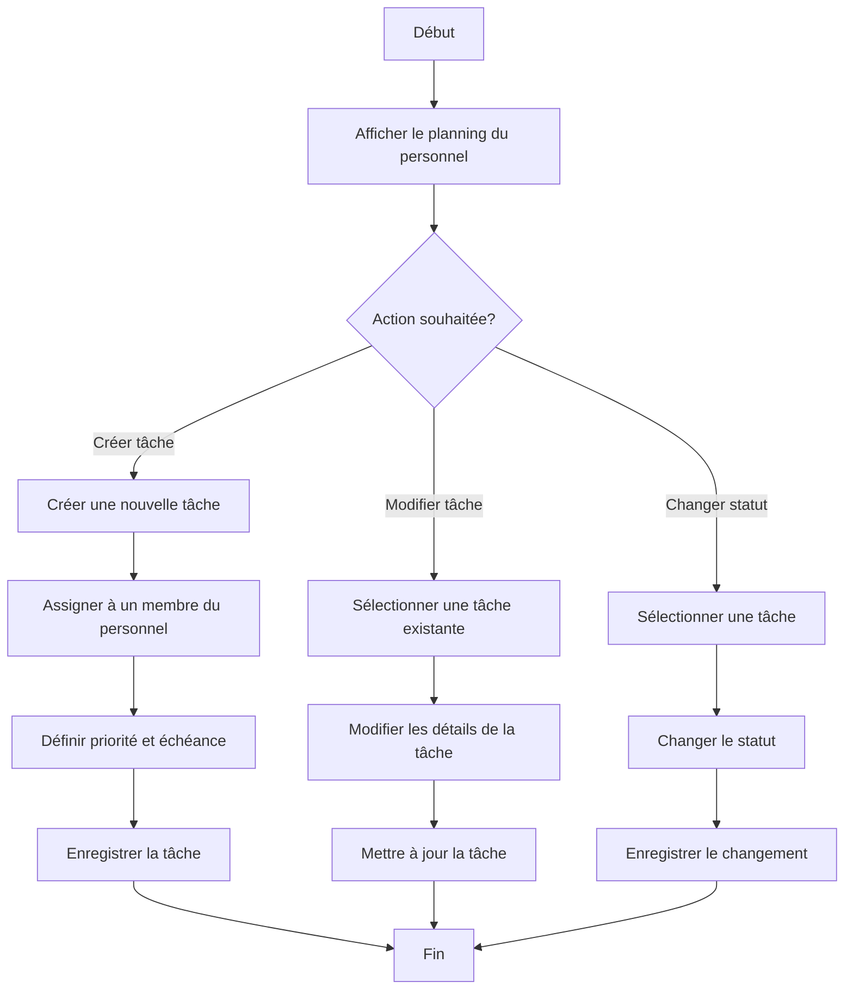
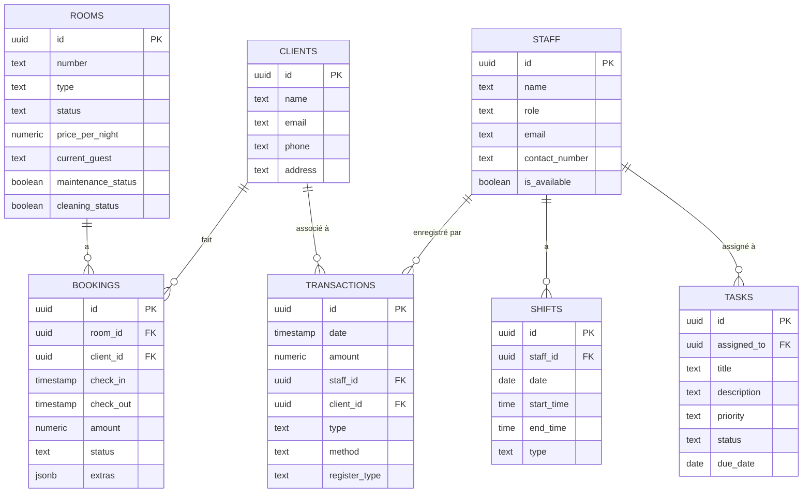
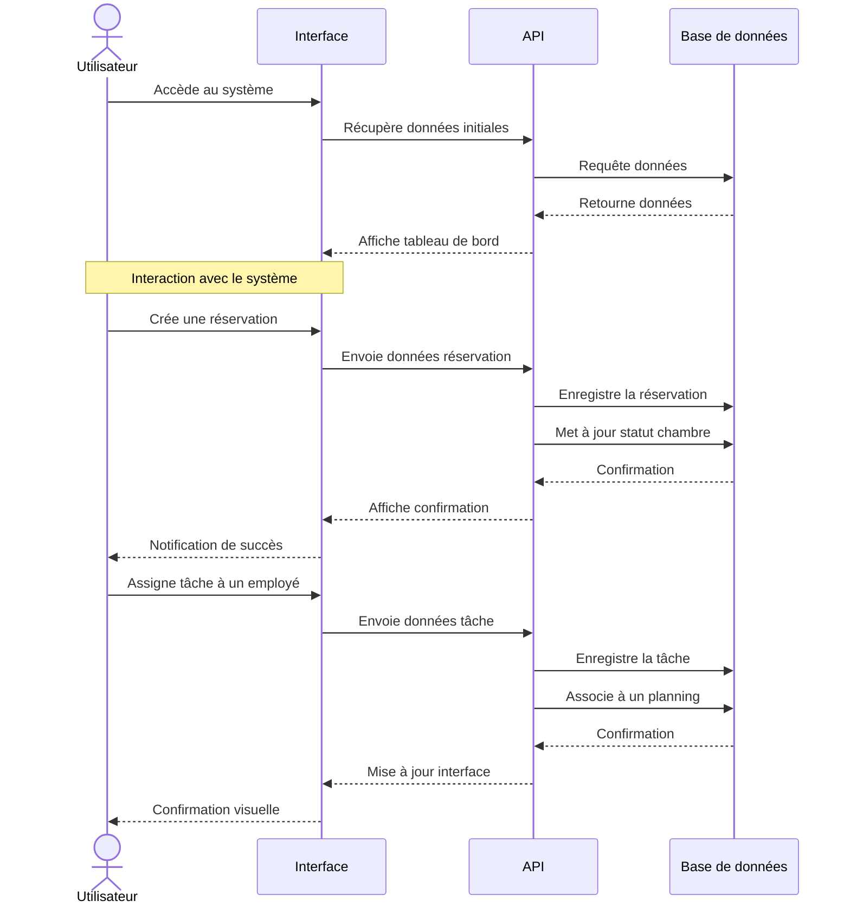

# Système de gestion hôtelière - Blueprint et workflow

## Architecture du système

Le système de gestion hôtelière est composé de plusieurs modules interconnectés:

1. **Gestion des chambres**
   - Affichage des chambres disponibles
   - Détails des chambres
   - Maintenance et nettoyage
   - Réservation des chambres

2. **Gestion du personnel**
   - Annuaire du personnel
   - Planning des équipes
   - Assignation des tâches
   - Suivi des performances

3. **Gestion des clients**
   - Enregistrement des clients
   - Historique des séjours
   - Préférences et notes
   - Facturation

4. **Gestion financière**
   - Registres des transactions
   - Facturation
   - Paiements
   - Rapports financiers

5. **Gestion des services**
   - Services disponibles
   - Réservations de services
   - Tarification

## Diagramme de structure

## Workflow de planification et tâches

## Workflow de réservation de chambre

## Workflow de gestion des tâches du personnel

## Structure de la base de données

Principales tables et leurs relations:

## Flux d'interaction utilisateur

## Technologies utilisées

- **Frontend**: React, TypeScript, Tailwind CSS, Shadcn/UI
- **Gestion d'état**: React Context, React Query
- **Routage**: React Router
- **Backend**: Supabase (PostgreSQL)
- **Visualisation**: Charts (recharts)
- **Dates**: date-fns
- **Notifications**: sonner
- **Formulaires**: react-hook-form

## Principes de conception

1. **Interface responsive** - Fonctionne sur tous les appareils
2. **Navigation intuitive** - Structure logique et accès rapide aux fonctions clés
3. **Design moderne** - UI claire et élégante avec Tailwind et Shadcn/UI
4. **Performance optimisée** - Utilisation de React Query pour la gestion des données
5. **Architecture modulaire** - Composants réutilisables et maintenables
