# Système de gestion hôtelière - Workflow détaillé

## 1. Gestion des chambres

### Vue d'ensemble des chambres
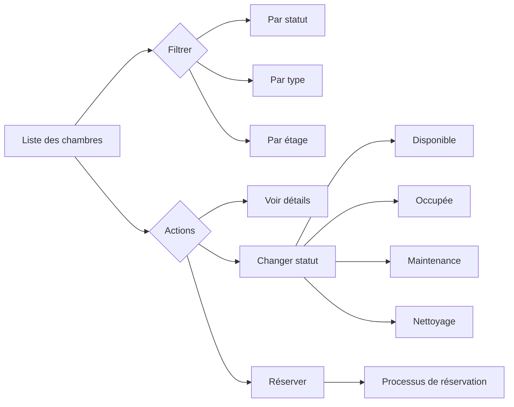

### Processus de réservation
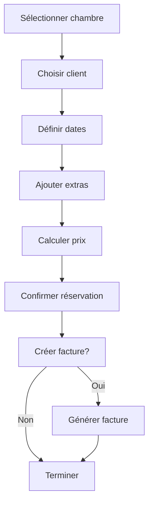

## 2. Gestion du personnel

### Organisation des équipes
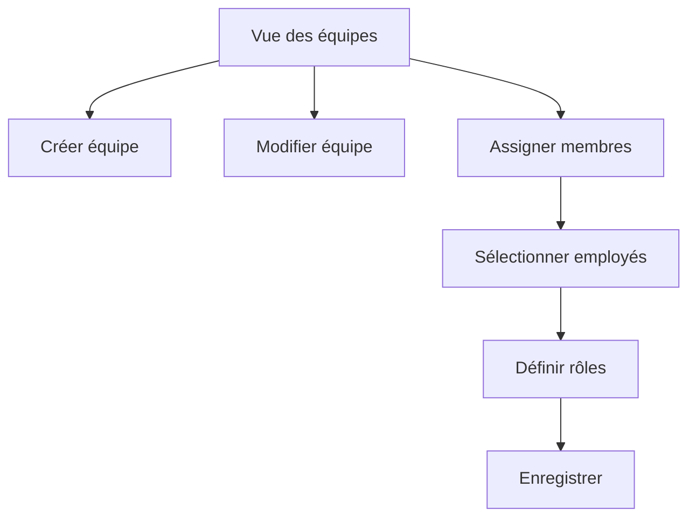

### Planification des shifts
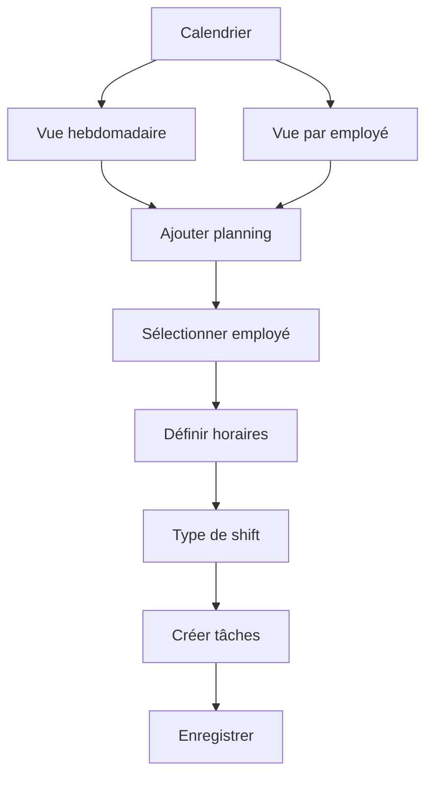

### Gestion des tâches
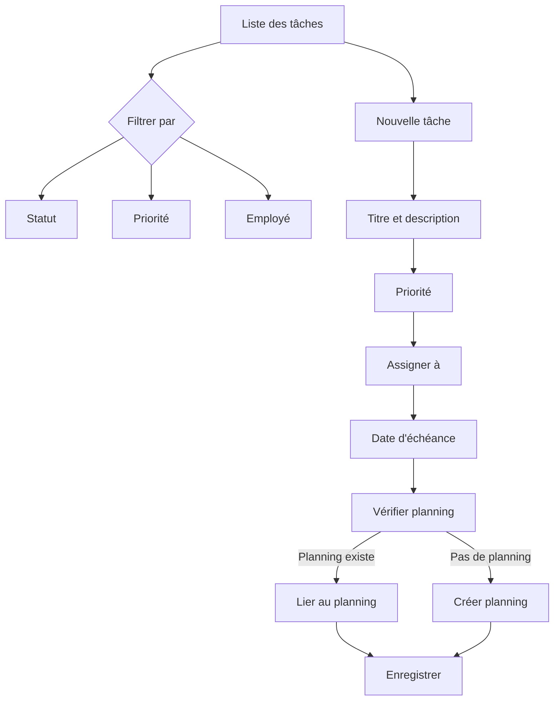

## 3. Processus financiers

### Enregistrement des transactions
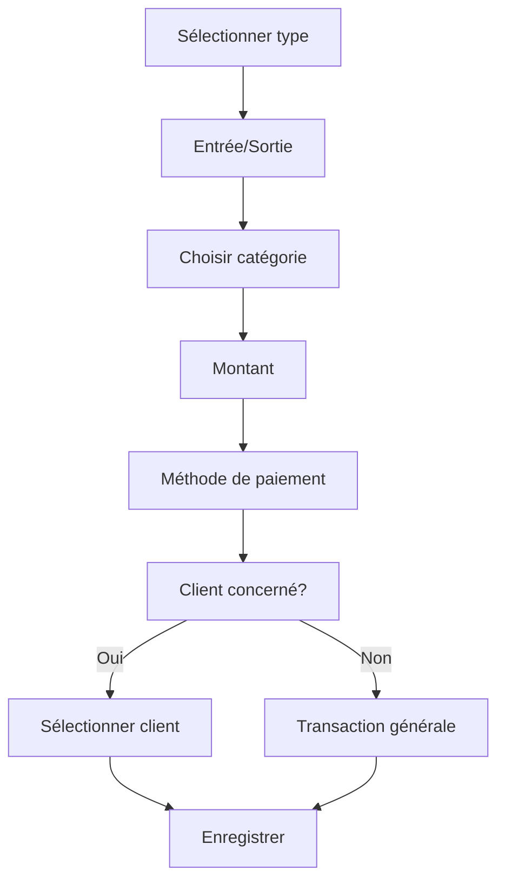

### Gestion des factures
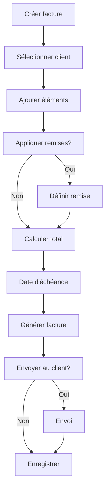

## 4. Interactions entre les modules

### Réservation et facturation
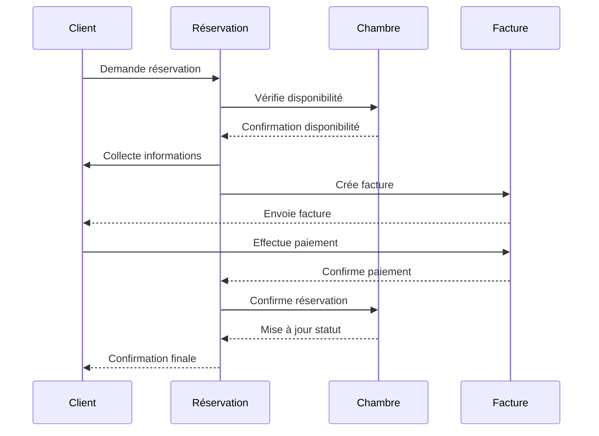

### Tâches et planning du personnel
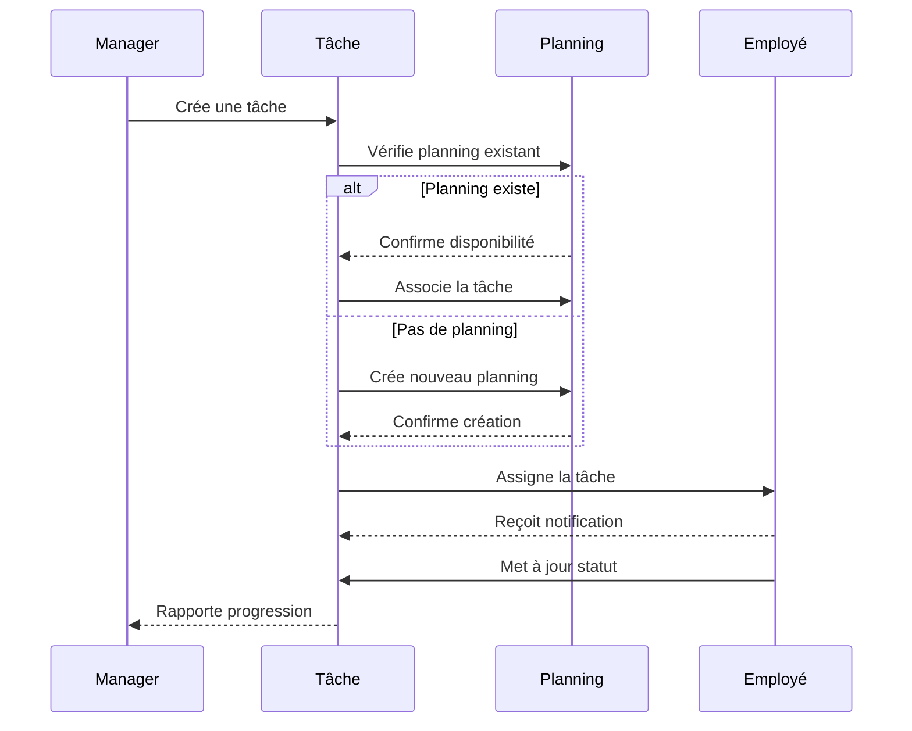

## 5. Gestion des clients

### Parcours client
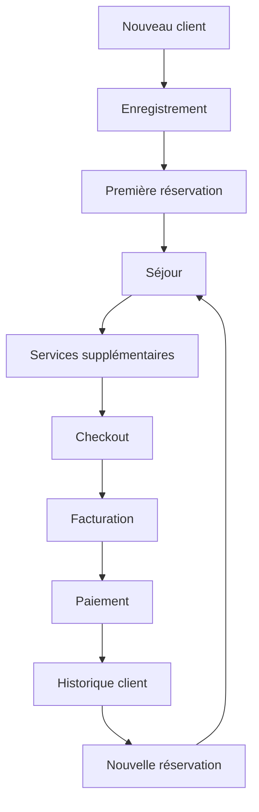

### Actions sur profil client
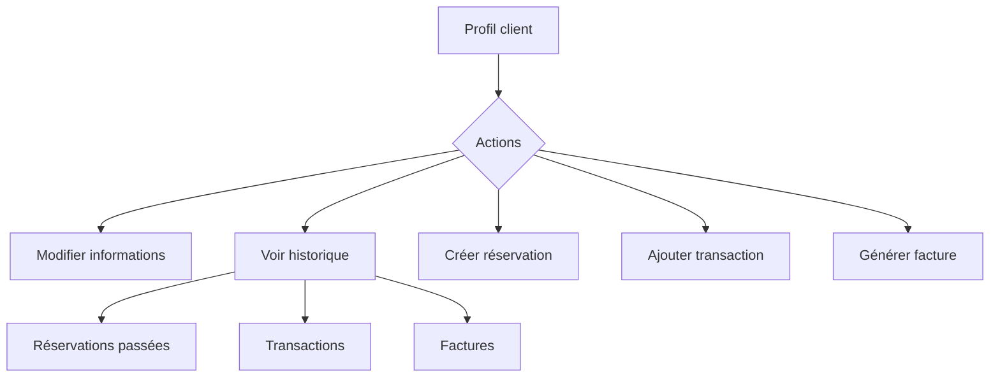

## 6. Architecture de l'application

### Flux de données
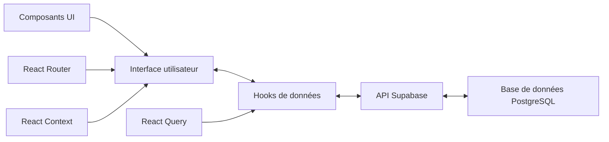

### Structure des composants
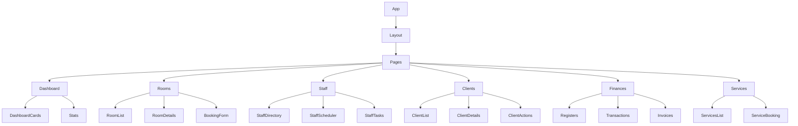

## 7. Points d'intégration

### Intégration avec systèmes externes
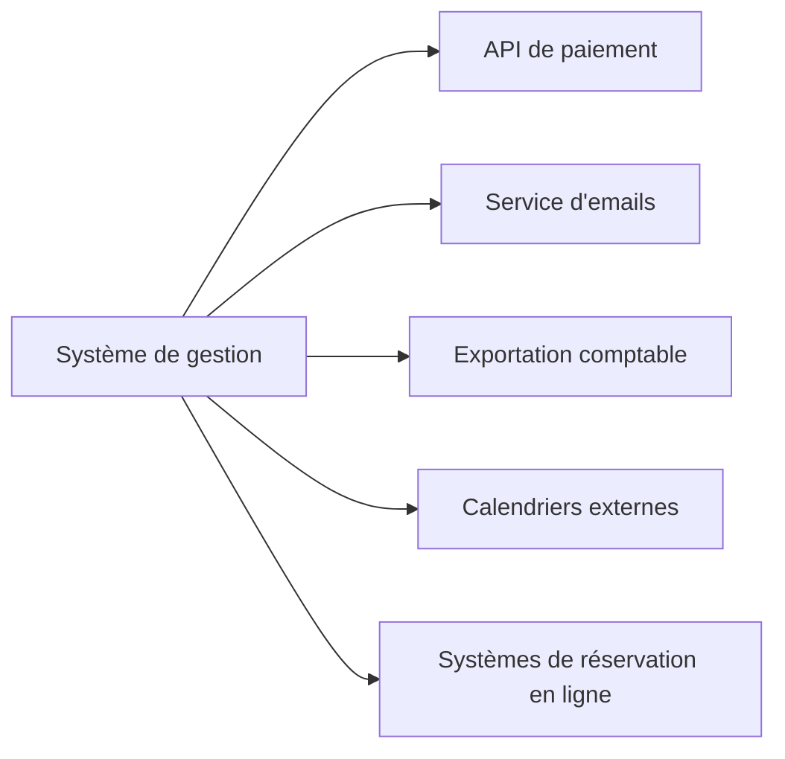
