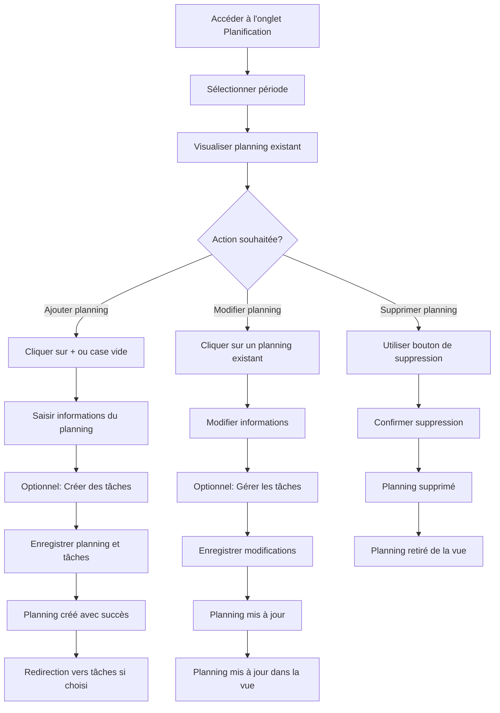
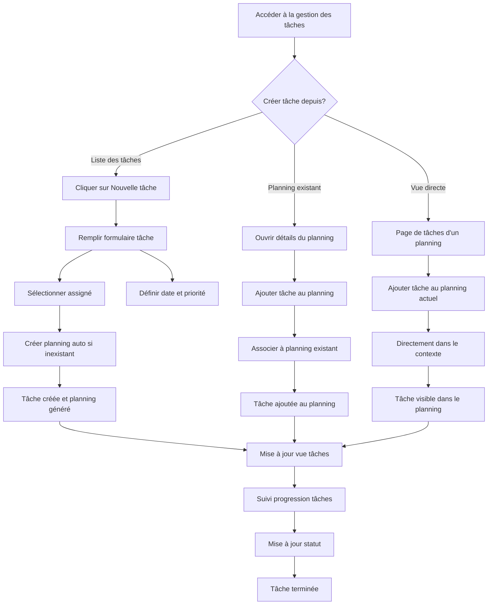
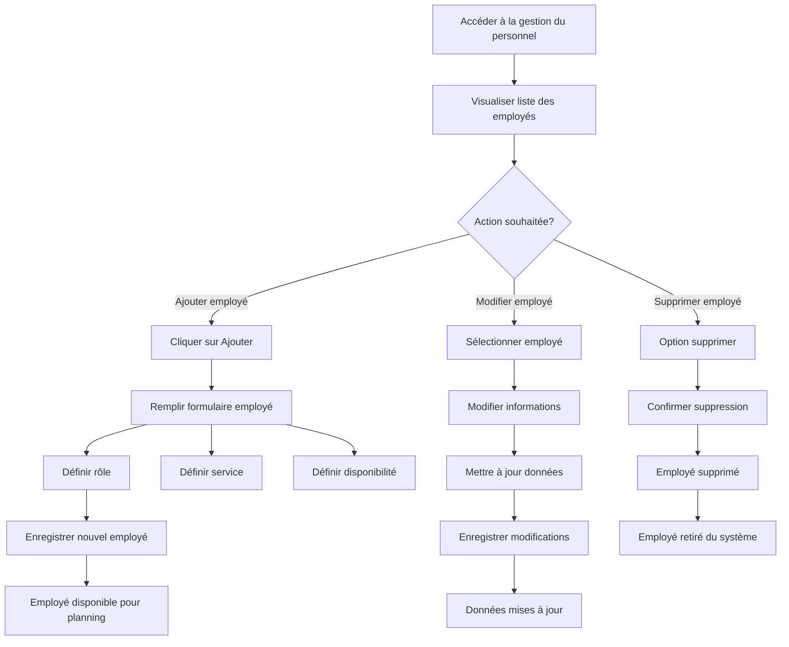
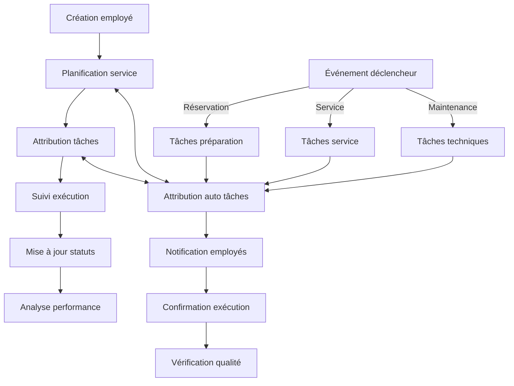
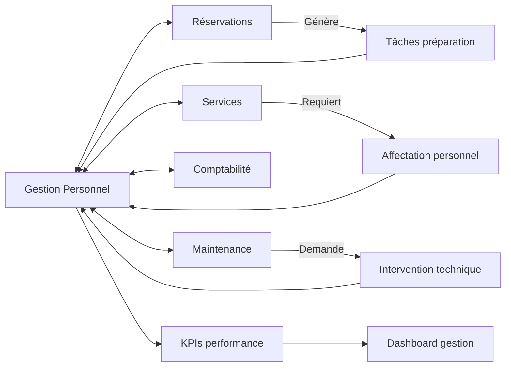

# Système de Gestion du Personnel et des Tâches - Workflow

Ce document décrit les principaux workflows utilisateur dans le système de gestion du personnel et des tâches.

## 1. Planification du Personnel

### Vue d'ensemble du processus

## 2. Gestion des Tâches

### Processus de création et suivi

## 3. Gestion des Employés

### Processus d'ajout et modification

## 4. Workflow Intégré

### Vision globale

## 5. Intégration avec Autres Modules

